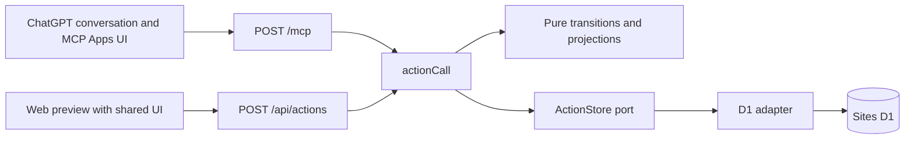

# Ariadne architecture

Current sources are [domain](lib/domain/core.ts), [application](lib/application/action-service.ts), [D1 adapter](lib/adapters/d1-action-store.ts) and [schema](db/schema.ts).

## Responsibilities and runtime

Ariadne provides structured task-data API/MCP tools and a shared UI so users can delegate task management to their LLM, using GTD or any method supported by the available data operations. ChatGPT is the current delivery environment. Meaning, organization, recommendations and workflow policy belong to the user's caller-side LLM. Ariadne validates input, persists state, projects lists and protects revision, replay, Undo and owner boundaries.

User prompts, dot and caller-side schedulers decide when and how to invoke the tools. An agent can collect Slack/email commitments through its own authorized tools and write actions through Ariadne without a dedicated Ariadne integration. Source collection, external observation, scheduling and notification remain caller responsibilities. Ariadne publishes composable data capabilities rather than owning an assistant workflow; callers can change methods while keeping the same saved data.

The architectural policy is to expose the data layer through a thin API/MCP interface that guarantees flexibility, robustness and safety. Humans and caller LLMs decide how to interpret and use the data. Operations expose composable state capabilities without requiring a particular planning method, classification meaning or assistance workflow. Backend restrictions must be justified by authorization, data integrity, deterministic operation semantics or resource limits; assistance recommendations are not additional validation rules.

Thinness preserves the shared application/domain path and its atomicity, owner isolation, revision, replay and Undo guarantees. Saved descriptive text is caller-controlled context, not executable policy or authorization. Projects, tags and perspectives expose optional exact-text descriptions through the shared data API. Descriptions do not affect classification or perspective extraction.

React 19 and TypeScript use App Router APIs through vinext/Vite. The production entry is [build/sites-worker.ts](build/sites-worker.ts), running in a Sites-managed Cloudflare Worker with D1.

| Location | Responsibility |
| --- | --- |
| lib/domain/ | Pure validation, lifecycle, containment, dates, order, direct flags, preview, delta, Undo |
| lib/application/ | Operation orchestration through store, clock and ID ports |
| lib/adapters/ | D1 SQL, atomic revision CAS, receipts, bindings |
| lib/server/ | Authentication and production composition |
| app/mcp/route.ts | JSON-RPC, tools, UI resources and host instructions |
| app/api/actions/route.ts | Web JSON entry and authentication/Origin/content-type checks |
| lib/ui/model/ | Pure draft, retained-request and control decisions |
| lib/ui/application.ts | UI state and progress through call, ID and view ports |
| lib/ui/adapters/ | DOM, host messaging and acceptance fixture effects |
| lib/widget.ts | Self-contained UI composition |
| lib/domain/assistance.ts | Host-delivered assistance policy |
| app/board.tsx | Web iframe and HTTP relay using the shared UI |
| db/, drizzle/ | Schema and SQL migrations |
| scripts/, build/ | Execution-profile, build, migration and verification helpers |

Pure code receives explicit time and never reaches DB, HTTP, DOM, environment, randomness or a host. Effects are injected at composition. UI never connects directly to D1. Both entry points use the same actionCall and persistence path.

## Action contract

Action is the product entity name. Relationships are parent-child containment only; there are no independent prerequisite edges, parallel/sequential modes or order-based execution restrictions.

Actions store a nonnegative integer sibling rank named order. Roots are ordered within a project or unassigned scope. Default creation and destination moves append; equal ranks use ID tie breaking. Reads emit parents before descendants. Direct flagged is a boolean with no inheritance. These attributes preserve lifecycle, Due and Defer.

- C1: ancestor Defer affects descendants' visibility without overwriting their own dates.
- C2: completing a parent atomically completes descendants; completing children never automatically completes the parent.
- C3: date-only Defer resolves 09:00 in the explicit request timezone to a saved UTC instant.
- C4: explicit on-hold remains unfinished and in normal view unless deferred.

Lifecycle is active/on-hold/completed/dropped. Read-time projection evaluates Defer without saving or reopening actions. Dropped records remain editable. Inbox projects all unfinished project-unassigned actions, including deferred ones. Order and Flag do not manufacture deadlines or commitments.

## Persistence and recovery

Reads obtain a consistent owner snapshot in one D1 batch. Owner revision is the latest operation revision, zero when empty. The receipt INSERT trigger conditionally checks revision. Changed rows, identity markers, receipts and pruning to the latest 100 operations commit atomically; unrelated rows are not rewritten. No owner_state or full-snapshot replacement exists.

Writes require schemaVersion 2, an operation ID and current expectedRevision. Identical replay uses the receipt and returns current state; different input under the same ID is rejected. Unknown outcomes retain exact arguments and IDs. Preview does not reserve state or generated IDs. Undo compares exact affected action state/revision and catalog identity markers, preserving later unrelated changes and rejecting target conflicts.

Trusted Sites authentication headers determine owner. Request arguments cannot override it. Queries, mutations and receipts stay owner-scoped. Task text, personal data and credentials must not be logged indiscriminately.

## Verification

The database schema uses actions and action_tags. Deployment must preserve the configured Sites project, DB binding and private visibility. Hosted migration and deployment require their own execution and verification.

Use pnpm check and pnpm build for code changes. See [testing](docs/technical/testing.md), [data model](docs/technical/data-model.md), [API](docs/technical/mcp-api.md), and [deployment](docs/technical/deployment.md). SQLite, memory stores and mock-host UI tests do not establish hosted D1, Sites authentication or ChatGPT Work acceptance.

Calendar synchronization, notifications, background jobs and external observation are not performed by Ariadne. Callers may compose those behaviors with their own capabilities and the published tools; this is not a restriction on caller-side workflows. Planned and duration estimates are unsupported data fields.

## Saved perspectives

Owner-scoped perspectives persist extraction conditions with a name and optional description for context. Pure domain evaluation filters the existing action projection at an explicit read time, preserving relative order. Definitions are stored separately from actions and participate in the same consistent snapshot, atomic delta/revision/receipt and Undo path. Project/Tag references and deleted perspective identities are protected. list_perspectives and query_perspective expose views through the shared service. The shared UI provides Projects, Tags and saved Perspective browsing over the full read-time snapshot, preserving action order and unsaved proposals. Projects and Tags use a combined catalog hierarchy and exact-membership Action outline, with typed Action/Project/Tag inspectors. Catalog names and descriptions save through existing catalog edit operations; named inline catalog creation uses get-or-create; header creation opens a local catalog draft and its Name inspector, committing a distinct catalog only after a valid nonempty name. Tag occurrence selection is separate from shared Action identity. Perspective conditions and descriptions are visible; Perspective creation/editing remains available through caller-side API operations.

The UI accepts persisted state only as a complete current snapshot with revision and actions, projects, tags and perspectives arrays. Partial replies retain the previous snapshot and exact pending request until verified. Action and catalog drafts validate their complete required Title or Name; no legacy blank-record exceptions apply.

The shared UI starts a local Action draft in every view without a persistence request. A valid nonempty Title, with complete valid edited fields and resolved parent/classification dependencies, commits one ordinary Action through the serial write lane. An explicitly selected visible persisted Action becomes the new Action’s parent and supplies its own project; an exact Tag occurrence contributes that direct Tag. Selected Project or Tag nodes supply direct classification, and no valid visible selection creates an unassigned root. Untouched drafts are removed when abandoned, including closing a catalog inspector; edited invalid or emptied proposals remain available until explicitly discarded. Explicit Add while a temporary object is selected discards that proposal before creating one replacement in its valid persisted parent/classification context. Pending or unknown persistence and protected dependent references block replacement rather than losing identity. Local identities never cross the API port. Confirmed generated UUIDs replace only identity and reference fields, preserving raw user text, newer proposals and the exact unknown request. Parent lifecycle and dates remain unchanged. Header Project/Tag drafts require valid nonempty names before distinct creation. Notes-only local proposals remain unsaved until a valid Title is supplied. Clearing a persisted Title retains an invalid local proposal without overwriting the saved value. Initial tag associations use the existing atomic delta/revision/receipt/Undo path.

The shared UI saves valid editor changes through a debounced, owner-wide serial mutation lane. Blur and in-app navigation flush pending input; IME final text stays bound to its original Action. Routine changes use existing preview validation and immediate apply without a confirmation dialog. Captured proposal acknowledgment preserves newer input. Field baselines distinguish own confirmed writes from external corrections; overlapping edits require inline reconciliation. Unknown outcomes retain exact operations, and an applied receipt whose refresh fails keeps the lane gated until authoritative refresh.

Action list movement uses one bounded `action_move` intent over a complete owner snapshot. Selected roots move as a bundle; containment and destination sibling sequence change atomically while classification, lifecycle, own dates and subtree order remain unchanged. The pure planner includes hidden siblings, preserves source gaps and uses deterministic destination ranks. Existing CAS, delta, receipt and Undo apply unchanged. Direct status icons and Project/Tag assignment share the UI serial autosave lane; pointer/touch and keyboard chooser produce the same movement intent.

The responsive header shows the current function name/icon and a floating navigation menu, replacing sidebar and mobile view selectors. Checked contextual display choices and icon-only Refresh share that header. Refresh sits at the far right and also exposes global save state through an accessible live description, with animation only during actual writes and reduced-motion support. Header Add Project/Tag opens the matching tree and a temporary catalog inspector; same-view selection supplies its catalog parent, while a different view creates at the root. Add Action uses the explicit visible object context. Searchable Project/Tag pickers use stable catalog UUIDs and inline get-or-create; creation and optional assignment remain separate serial writes. Action-to-catalog drops use one atomic multi-Action classification operation. Native mouse and pointer/touch gestures share frozen intent, preserve list geometry during dragging and reuse the existing receipt/Undo path.

Tree row edges and horizontal movement choose containment depth without a separate root drop region. A pure hit-intent model consumes adapter-supplied geometry and full semantic ancestry. Project and Tag movement change durable sibling order or parent through one ordinary atomic operation. Both catalog ranks use required order/name/UUID comparison; missing order is invalid. Project and Tag order use additive migrations 0013 and 0016 respectively. Catalog gestures are single-object and preserve Action membership.

Due and Defer share native date selection and an explicit 24-hour text clock. A first date selection defaults to 09:00 in the explicit client timezone. Complete numeric clock input is normalized for mobile entry; partial input remains an unsaved proposal. Custom seconds and milliseconds, saved UTC instants, and DST gap/fold rejection are preserved. Clearing Due saves null; explicitly clearing Defer releases it.

Action lifecycle controls and the orange Flag control have a visual gap. Validation feedback is adjacent to the responsible editable fields with invalid/described-by semantics; conflict, unknown-result and transport recovery retain their separate existing controls. Date/time placeholders remain HH:mm without replacing partial raw input.

Projects and Tags require durable nonnegative safe-integer sibling order. Catalog outlines use order, then exact name and UUID. Both catalog kinds support relative before/after/inside/root moves through their existing atomic owner-revision/receipt/Undo path. Tree-edge outdent preserves Action classification and does not add a separate drop area.
