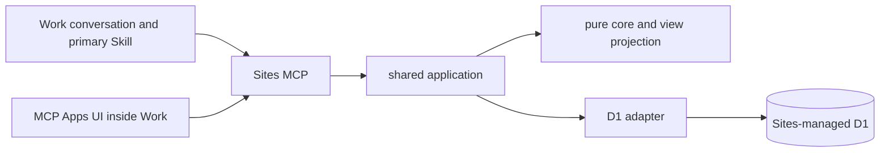

# MVP Technical Design After Work Measurements

## Decision and Rationale

Select Sites + D1 + MCP Apps UI inside ChatGPT Work as the current implementation platform. Move Cloud Run + Firestore to the alternative-history record. [Work measurements](../../note/note-20261001-work-m0-sites-proof.md) showed that the basic path for a dedicated UI, conversation, persistent storage, and retrieval in another conversation works. Imported verification source commit `c3171a04f3dab9970175a4f2866713b84e7038e7` into this repository and implemented the MVP. On 2026-10-03, completed deployment to personal-only Sites, in-scope live Work acceptance, and acceptance after fixes for BUG-01/02, recovery from unknown results, and assistance scenarios S17–S22. Scope and evidence are in the [final acceptance record](../../note/note-20261002-work-benefit-acceptance.md). Do not create duplicate Sites or Plugins.

Preserve C1–C4 and S01–S16 from [requirements](requirements.md) and [UX](ux.md). Acceptance verification is limited to display, operations, and saved results in Work. Do not add ChatGPT authentication, cross-account separation, CSP configuration, infrastructure-only tests, or cost evaluation to completion criteria. Preserve the implementation contract in which the server determines the owner and all SQL is scoped by owner; excluding a check from acceptance does not remove the authorization boundary.

## Responsibility Boundaries

B1: Obtain the Principal from the existing verified Sites/Plugin authentication boundary. Do not trust owner/email arguments or redesign authentication as custom OAuth. Record existing identity mapping from the retrieved source.
B2: Conversation and UI use the same Command and application. Do not expose arbitrary SQL or user IDs.
B3: Generate a pure, validated ChangeSet from the complete GraphSnapshot, Command, and fixed `now`.
B4: D1 adapter reads the snapshot and atomically saves conditional owner-revision updates, business deltas, receipts, and operation history.
B5: Project normal/deferred/completed state, waiting reasons, and retrieval time from GraphSnapshot and server `now`. Reads do not write.
B6: Keep existing `/mcp` and MCP Apps resource/bridge. Return a shared versioned response to conversation and UI.
B7: UI separates the saved snapshot from unsaved drafts and holds no token or database access.

## Persistence Model

Keep the existing server-side owner ID and use opaque business IDs. D1 is the source of truth. Do not use localStorage/widgetState as the source of truth.

| Table | Main contract |
| --- | --- |
| owner_state | owner PK, schema_version, revision, timezone, commit_token |
| captures | Composite owner/id PK, original input/source, pending/applied, applying operation_id, version |
| tasks | Composite owner/id PK, title, notes/reference, parent_id, status(open/done/cancelled), due_at, defer_until(UTC), defer_zone, manual_wait, source_capture_id, version, timestamps |
| dependencies | Composite owner/dependent/prerequisite PK, version. Independent of parent-child |
| operations | Composite owner/operation_id PK, canonical_payload, fingerprint, revision_before/after, saved result, affected items and before/after values, undo_of, timestamps |

Parent-child and references require the same owner. Never overwrite operation ID/input correspondence. Receipts do not expire in the MVP. Keep history separate from business data; do not pack the entire graph into one JSON row. Store parent-child, dependencies, and individual Defer as canonical state rather than duplicate projections.

Add versioned SQL migrations while preserving existing M0 tasks. Preserve existing id/title/owner/created_at and migrate them as open, root-level, not deferred, and without dependencies. The user confirms and sets timezone. Do not assume a legacy task revision equals a new owner revision. Do not fabricate full historical receipts from legacy `last_request` alone. Report retries of legacy operations as `unknown_legacy_operation` and switch to the new operation namespace. Reject writes from an old UI with a schema mismatch, preserve its draft, and guide it to refresh. Do not run old and new write endpoints together.

## D1 Updates and BUG-01 Prevention

Request: `{schemaVersion, operationId, expectedRevision, kind, payload}`. Generate the fingerprint from the entire normalized request, including expectedRevision. Resolve ambiguous dates to UTC in preview and include the resolved value so retries do not reinterpret them.

1. Read the receipt for owner/operationId first. If canonical payload matches, return the saved result; reject different input with `idempotency_conflict`. Do this before checking for a stale version.
2. Compare snapshot revision with expectedRevision and validate invariants in the pure core.
3. In one D1 batch, update owner_state only when the expected revision matches and no receipt exists; increment revision by one and set a new random commit_token for this attempt.
4. Execute every business INSERT/UPDATE/DELETE and receipt/history write only when owner_state.commit_token matches this attempt's token. Use WHERE EXISTS for DELETE/UPDATE and conditional INSERT SELECT for INSERT. Do not include unconditional writes.
5. Treat the operation as successful only if the first UPDATE affected one row. If it affected zero, later statements make no changes; reread the receipt and distinguish successful retry, input mismatch, and revision conflict. SQL errors roll back the entire batch. Since an unsatisfied condition resulting in zero rows is not an SQL error, handle it explicitly.

This relies on the transaction contract of D1 batches; implementation with Sites bindings is not yet verified at the design stage. Prohibit pseudo-transactions that run sequential SQL in separate awaits, duplicate detection using only last_request, and automatic conflict overwrites. Bind SQL parameters. `readSnapshot` retrieves state/tasks/dependencies/captures in one read batch and returns a consistent complete revision. If API capacity requires splitting, confirm matching revisions before and after for up to three attempts; do not treat a partial result as success if completeness cannot be assured.

Receipt result and latest list are separate. After a successful retry, fetch the latest list again. For operation-history inverse diffs, compare each target entity's applied version with its current version and revalidate graph invariants. Do not reject Undo solely because an unrelated task changed. Save Undo atomically as a new operation and reject a second Undo of the same operation.

## Defer, Parent-Child, and Dependencies

Using fixed server `now`, project an open task with any future Defer on itself or an ancestor as deferred; project the rest as normal and done as completed. Hide cancelled tasks. Show each active Defer reason and individual date. Do not use a scheduler, TTL, or LLM when a date arrives.

Preview date-only input as 09:00 in the configured IANA zone and save it in UTC. A setting change affects display conversion only. Require correction for ambiguous or nonexistent local times. Show Defer deadline risk, affected scope, and UTC instant in preview, then bind commit to the revision. If revision changes, preview again.

Reject self-references, cycles, and cancelled references for parent-child and dependencies. Reject adding/moving an open child under a completed parent. Reject completing a parent with incomplete descendants and do not auto-complete a parent when all children finish. Preserve original Defer when reopening; preview and apply required reopening of completed ancestors together. Keep dependency waiting in the normal list with a reason, and do not clear user Defer when a dependency resolves. Update external arrivals only from user input.

## UI State and BUG-02 Prevention

Manage saved snapshot, each task's draft (input value/base version/dirty flag), and in-flight request separately. A refresh updates only the snapshot and never replaces dirty drafts. On conflict, show the latest saved value beside the user's draft. “Apply my draft to the latest state” requires explicit user action and creates a new operation ID/revision with a new preview/save. “Discard draft” is also explicit. Do not lose a draft on rerender, list switch, or error. If closing loses an unsaved draft, identify it as unsaved; never display it as saved.

After a 20-second timeout, show an unknown result and retain original operation ID and input. “Check result” calls operation_status; “Retry same request” reuses the same payload/ID. Do not report a communication exception as a failed save. Prevent double-clicking while a request is in flight, but rely on receipts for correctness. Convey retrieval time, list state, waiting reasons, and save result without relying only on color; preserve keyboard operation.

## MCP and Skill Contract

`ariadne_open` and `ariadne_list_tasks` return versioned projections. Route existing add/rename operations through the same application and use a shared request envelope. Add capture_intent, get_relevant_context, preview_change, apply_change, operation_status, and undo_change. Enumerate kinds for structuring, correction, parent-child/dependencies, Defer/clear, completion/reopen, waiting, settings, and Undo; reject unknown kinds/fields.

The primary Skill saves original input → retrieves necessary context → structures it → previews when needed → applies → retrieves again. Do not automatically turn reference information into tasks or structure the same saved capture twice. Separate natural-language interpretation in conversation from version/relationship/date enforcement in core. Do not add independent server-side LLM inference.

## Implementation Order and Work Acceptance

T0: Import Sites source and dependencies/migrations/existing Plugin boundaries into this repository; compare against the recorded commit. Do not recreate the M0 path.
T1: Pure core for C1–C4, dates, graph, projections, and inverse diffs.
T2: D1 schema migration, owner revision, immutable receipts, and conditional batch. Fix BUG-01.
T3: Shared MCP/Skill, preview/apply/status/undo, and explicit rejection of old UI versions.
T4: List/detail/Defer UI, draft preservation, BUG-02 fix, unknown-result handling, and retries.
T5: Measure in the same Work/Plugin the in-scope behavior for C1–C4 and S01–S16, negative tests, and BUG regressions. Distinguish unimplemented, failed, and unverified cases.

Verify the BUG fixes in Work before and after adding Defer. Infrastructure/local checks support implementation integrity but do not count as Work passes. Measure unknown-result display and retry with the same ID in Work. Do not add cross-account separation, CSP, infrastructure fault injection, or cost analysis to T5 completion criteria.

## Design Rationale and Unverified Items at the Time

See [Work measurements and two bugs](../../note/note-20261001-work-m0-sites-proof.md), [measurement JSON](../../note/evidence/work-m0-live-20261001.json), and [new ADR](../../adr/adr-20261001-sites-d1-work-mvp.md). Checked the [official D1 batch contract](https://developers.cloudflare.com/d1/worker-api/d1-database/) on 2026-10-01. Sites batch/migration behavior, all MVP features, and real Work behavior after BUG fixes were unverified at design time. This document consistency check is not independent review, implementation, or live acceptance. Design was created in the main session based on existing user approval to remove external delegation.

## Contracts Made Concrete in Local Implementation

See the [implementation record](../../note/note-20261001-structured-todo-implementation.md). Compare retries using exact canonical payload equality and preserve the original request receipt unchanged after changes. The D1 batch saves a complete owner snapshot conditionally using a token and adds an atomic receipt. Increment timezone_revision only when the setting changes to prevent ABA on settings Undo. Deployment and acceptance in Work were not yet done at that point.

## Alignment with the Benefit-Led Requirements Update (2026-10-02)

Add PR01–PR07 from [requirements](requirements.md) and S17–S22 from [UX](ux.md) as assistance-layer contracts. Put interpretation, questions, suggestions, and continuation decisions in dot/prompt; do not add an independent backend LLM. Use original input, notes, existing state/receipts, and versioned operations. This documentation update does not change schemaVersion 2 or the database.

Later implementation/delivery verification covers rereading unresolved captures, carrying forward user corrections, distinguishing suggestions from all items, cancellation operations, and delivering prompts to the real host. Do not assume the existing Skill and UI satisfy every additional condition. Verify missing operations or representations during implementation; do not disguise new requirements as existing fields. Keep FR01–FR15 as contracts for existing operations and trace PR requirements separately to assistance tests in verification.

## Implementation and Acceptance Completed on 2026-10-03

The unverified statements above are historical design-time notes. The [final Work acceptance record](../../note/note-20261002-work-benefit-acceptance.md) documents deployment and live acceptance for in-scope MVP. The host failed to treat ambiguous “stop for now” input correctly when assistance guidance was only in initialize instructions, so the latest snapshot now also delivers `assistance_policy`. `list_scopes` computes IDs from projected views and no longer counts cancelled items as part of the normal total. The save schema remains at version 2. When an incomplete child blocks parent completion, the rejection reason includes the child's name.
